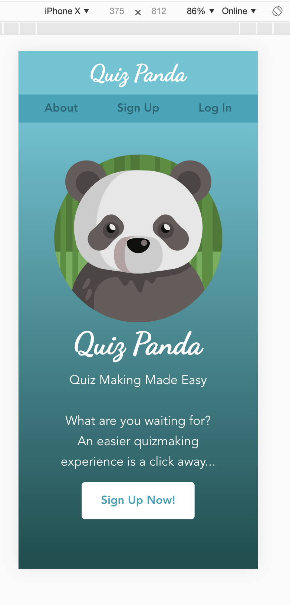
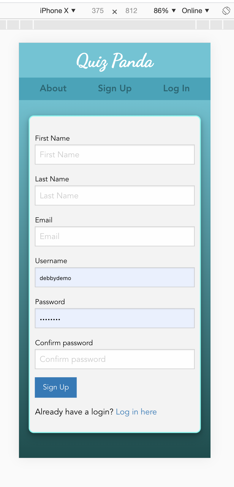

# [Quiz-panda](https://quizpanda.herokuapp.com/)

## Quiz Making Made Easy 

###  Quiz Panda is a full stack application that allows user to create, edit and delete quizzes with multiple choice questions.

## Table of contents
* [General info](#general-info) 
* [Screenshots](#screenshots) 
* [Installation](#installation) 
* [Usage](#usage)
* [Credits](#credits)
* [Features](#features) 
* [Status](#status) 
* [License](#license) 
* [Contributers](#contributers)


## General Info

This application will give you the ability to make multiple choice quizzes in a convenient way. You will be able to log in with a username that you create, to have access to your user profile and to view or edit the past quizzes. You will also be able to send the link to a quiz that you created via email. There is a leaderboard that will show the scores of the attempt.


## Screenshots

mobile screen size responsive

   


## Installation
To install:
* [Visual Code](https://code.visualstudio.com/docs/setup/setup-overview)
* [NodeJS](https://nodejs.org/en/download/)
* [MySql](https://dev.mysql.com/downloads/installer/)
* [MySqlworkbench](https://dev.mysql.com/downloads/workbench/)

In order to install, first download the files. Then you would open the terminal and type ```npm install``` . This will install all the npm packages listed under the dependencies in the package.json.( such as MySQL, express, express-handlebars, Node) Then you will open  MySQLworkbench and copy the data in schema.sql file in a SQL file. Once you click on the execute button database table is created for you locally. Then you will open terminal again and type the command ``` node server.js```. This will connect the server. Finally you will type ```localhost:8080``` in the browserwindow and use the application. If you would like to make changes to the application code files , you will have to restart the server after each change. To avoid that, you can install nodemon and use the command ```nodemon``` in the terminal so that it will automatically restart the server for you after each change.


## Usage 

To use this application, you can [click here](https://quizpanda.herokuapp.com/).

Upon clicking on the link above, you will create a user and password in the app, then you will be able to create a quiz with passing in questions and once finished by adding one or more email addresses, it will send an acces code to them to take the quiz. If you want to update your email or password in the acount , it can be done in the acount tab. You can delete a quiz or you can edit an existing quiz as well.


## Credits

Built with [Foundation](https://get.foundation/)

Fonts from [Google Fonts](https://developers.google.com/fonts)

Icons from [flat icon](https://www.flaticon.com/)

deploy with [heroku](https://dashboard.heroku.com/)

#### npm packages used:

 * [express-handlebars](https://www.npmjs.com/package/express-handlebars). 
 * [bcrypt](https://www.npmjs.com/package/bcrypt)
 * [dotenv](https://www.npmjs.com/package/dotenv)
 * [express](https://www.npmjs.com/package/express)
 * [sequelize](https://www.npmjs.com/package/sequelize)
 * [uniqid](https://www.npmjs.com/package/uniqid)
 * [Node MySQL 2](https://www.npmjs.com/package/mysql2)
 * [MySQL](https://www.npmjs.com/package/mysql)
 * [connect-session-sequelize](https://www.npmjs.com/package/connect-session-sequelize)
 * [express-session](https://www.npmjs.com/package/express-session)
 * [foundation-sites](https://www.npmjs.com/package/foundation-sites)
 * [mysql2](https://www.npmjs.com/package/mysql2)
 * [nodemailer](https://www.npmjs.com/package/nodemailer)
 * [session](https://www.npmjs.com/package/node-session)


## Features
List of features ready:
* Feature 1: Easy to navigate design.
* Feature 2: Ability to create, update, delete quizzes.
* Feature 3: Leaderboard to show the scores.
* Feature 4: Ability to create a user and password.
* Feature 5: Ability to send an email with an access code to 


To-do list:
* Adding the access code in the link received so that it will redirect the user straight to the specific quiz
* Add a database of sample questions 
* Having the ability to take a random quiz as a trivia game
* Adding option of creating quizzes with input answers or true false
* Adding math operations and symbols to choose from


## Status
Project is:  _Finished_

#### Inspiration
The  Covid 19 pandemic has caused the majority of the population to practice social distancing. This application can help teachers, tutors , parents as well as a fun way to stay connected with friends.


## License

MIT license 
Copyright © 2020 Zahra Ali Aghazadeh, Shaidee Alingcastre, Brett Belka and JJ Cardenas


## Contributors

Feel free to contact us via linkedIn for any feedbacks, questions or collaborations! 
You can also contact us at quizpanda2020@gmail.com


 <br>
Shaidee Alingcastre : Back End Developer/ Git Master
[Github](https://github.com/sali6798) ,
[LinkedIn](https://www.linkedin.com/in/shaidee-alingcastre/)


<br>
Brett Belka : Back End Developer/ Project Manager
[Github](https://github.com/bbelka) ,
[linkedIn](https://www.linkedin.com/in/brettbelka/)


 <br>
JJ Cardenas : Front End Developer / Designer
[Github](https://github.com/cardeens) ,
[LinkedIn](https://www.linkedin.com/in/jordanjcardenas/)


 <br>
Yalda Ali Aghazadeh : Front End Developer / Designer
[Github](https://github.com/zahraaliaghazadeh) ,
[LinkedIn](www.linkedin.com/in/yalda-aghazade)


